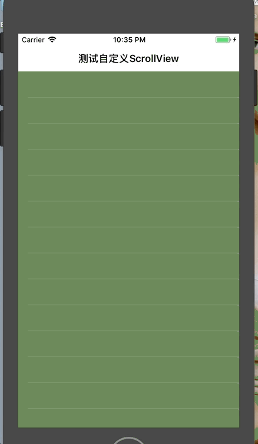

# ScrollView

[](https://travis-ci.org/hjphfut@163.com/ScrollView)
[](http://cocoapods.org/pods/ScrollView)
[](http://cocoapods.org/pods/ScrollView)
[](http://cocoapods.org/pods/ScrollView)

## Description
Replacement for UIScrollView.
You can use this scrollView as Multi-TableView's containerView, it is compatible with UITableViews.

## Example



```objc
import ScrollView

class ViewController: UIViewController {

    
    var scrollView:ScrollView!
    
    
    override func viewDidLoad() {
        super.viewDidLoad()

        configSubviews()
    }

    

}

extension ViewController {
    
    private func configSubviews(){
        
        let scrollFrame = CGRect(x:0,y:0,width:UIScreen.main.bounds.width,height:UIScreen.main.bounds.height)
        let subviewsCount = 3

        scrollView = ScrollView(frame:scrollFrame , contentSize: CGSize(width: scrollFrame.width * CGFloat(subviewsCount), height: scrollFrame.height))
        
        view.addSubview(scrollView)
        
        scrollView.scrollToPage = { page in
            let desc = "default horizontal scroll to page:\(page.x)"
            print(desc)
        }
        
        
        for i in 0..<subviewsCount {
            
            let subVC = ViewController2()
            
            addChildViewController(subVC)
            scrollView.addChildView(subVC.view, index: i)
        }
    }
    
}

```


## Installation

ScrollView is available through [CocoaPods](http://cocoapods.org). To install
it, simply add the following line to your Podfile:

```ruby
pod 'ScrollView'
```

## Author

hjphfut@163.com

## License

ScrollView is available under the MIT license. See the LICENSE file for more info.


**************

中文说明: 
- 当我们将UITableView放到UIScrollView上面时,经常会遇到手势冲突的问题, 这个自定义的ScrollView可以解决这个问题.
